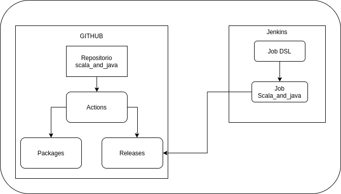

# SCALA AND JAVA

## Motivación 

Revisando un flujo de ejecución de un componente desde Jenkins que genera un reporte,
quice revisar como poder emular esta forma de trabajo, para lo cual utilizo este proyecto
como base.

## Descrición
En este *POC* se esta utilizando las siguientes tecnologías: 

* Maven: Administración de dependencias y gestión del proyecto.
* Scala and Java: Lenguajes de programación, busco posteriormente agregar funcionalidad que me
  permíta probar la interacción entre componentes creados por *Scala* y usados en *Java* y viceversa.
* Actions de Github: Como parte del flujo, en github se almacenara además del código, el jar que resulta 
del empaquetado para ser consumido como dependencia y se publica el *release* que posteriormente sera descargado 
desde Jenkins y ejecutado.
  
El flujo implementado es el siguiente:

* Los cambios al programa se suben al repositorio.
* Github detecta los archivos de configuración de *Actions* y ejecuta el flujo de CI.
* El flujo configurado para este proyecto, genera el package y lo pública en el servicio de *package* de Github.
* Posterior al paso anterior se toma el *jar* generado durante el *mvn package* y se adjunta a un release.
* En Jenkins se cuenta con un Job DSL que tira de otro repo para obtener las configuraciones de los jobs y crearlos
de forma automática.
* Ya con el job creado y configurado, al ejecutarlo esta programado para obtener el último release y ejecutarlo.  

java -jar target/scala_and_java-0.1.0-SNAPSHOT-jar-with-dependencies.jar 